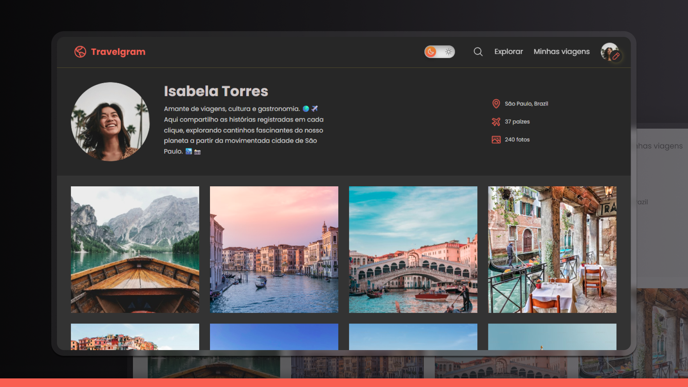

# 🌍 Travelgram - Travel Profile

A social network project focused on travel, developed to demonstrate fundamental and advanced concepts of front-end web development.



## 📋 About the Project

**Travelgram** is a web application that simulates a travel social network, where users can share their experiences through photos and information about visited destinations. The project features a complete user profile with photo gallery and travel information.

### ✨ Features

- 🎨 **Light/Dark Theme** - Dynamic toggle between themes
- 📱 **Responsive Design** - Adaptable to different screen sizes
- 🍔 **Hamburger Menu** - Intuitive mobile navigation
- 🎯 **Smooth Navigation** - Smooth scroll between sections
- 🖼️ **Photo Gallery** - Responsive image grid
- 📊 **Complete Profile** - Detailed user information
- 🎨 **CSS Animations** - Transitions and visual effects

## 🚀 Technologies Used

### Front-end
- **HTML5** - Semantic structure
- **CSS3** - Advanced styling
- **JavaScript (ES6+)** - Interactivity and functionality

### Implemented CSS Features
- **Custom Properties (CSS Variables)** - Color and typography system
- **Flexbox & CSS Grid** - Responsive layout
- **Media Queries** - Responsive design
- **CSS Animations & Transitions** - Visual effects
- **Pseudo-elements** - Decorative elements
- **CSS Modules** - Modular style organization

### Implemented JavaScript Features
- **DOM Manipulation** - Element control
- **Event Listeners** - Interactivity
- **Dynamic CSS Classes** - State control
- **Scroll Events** - Interactive navigation
- **Click Outside Detection** - Advanced UX

## 🌐 Demo

Access the online version: [Travelgram](https://maurodiogodev.github.io/travelgram/)

## 🎯 Applied Web Development Concepts

### 1. **HTML Semantics**
- Use of semantic tags (`header`, `main`, `nav`, `footer`)
- Accessibility attributes (`role`, `alt`)
- Proper hierarchical structure

### 2. **Advanced CSS**
- **BEM Methodology** (implicit in organization)
- **Mobile-First Approach** with responsive breakpoints
- **Design System** with CSS variables
- **Smooth Animations and Transitions**
- **Flexbox and Grid** for complex layouts

### 3. **Modern JavaScript**
- **Event Delegation** and **Event Bubbling**
- **Simple State Management**
- **Functionality Modularization**
- **Performance** with implicit debounce

### 4. **UX/UI Design**
- **Consistent Design System**
- **Visual Feedback** on interactions
- **Intuitive Navigation**
- **Basic Accessibility**

### 5. **Responsiveness**
- **Strategic Breakpoints**:
  - Mobile: < 580px
  - Tablet: 580px - 760px
  - Desktop: > 760px
- **Layout Adaptation** per device
- **Custom Mobile Menu**

## 🎨 Color System

### Dark Theme (Default)
- **Primary**: `#272727`
- **Secondary**: `#333333`
- **Brand**: `#EF5F4C`
- **Text**: `#D9D9D9`

### Light Theme
- **Primary**: `#f1f1f1`
- **Secondary**: `#FFFFFF`
- **Brand**: `#EF5F4C`
- **Text**: `#313131`

## 🔧 Customization

### Changing Colors
Modify CSS variables in `global.css`:
```css
:root {
    --brand-color: #YourColor;
    --bg-primary-color: #YourColor;
    /* ... other variables */
}
```

### Adding Breakpoints
Add custom media queries:
```css
@media (max-width: 992px) {
    /* Your styles */
}
```

## 📝 Next Implementations

- [ ] PWA (Progressive Web App)
- [ ] Lazy Loading for images
- [ ] Gallery filter system
- [ ] Map APIs integration
- [ ] Comment system
- [ ] Social sharing

## 🤝 Contributing

This is a study project, but suggestions are always welcome!

1. Fork the project
2. Create a feature branch (`git checkout -b feature/AmazingFeature`)
3. Commit your changes (`git commit -m 'Add some AmazingFeature'`)
4. Push to the branch (`git push origin feature/AmazingFeature`)
5. Open a Pull Request

## 📄 License

This project is under the MIT license. See the `LICENSE` file for more details.

## 👨‍💻 Developer

**Concepts applied in this project:**
- ✅ Semantic HTML
- ✅ CSS Grid & Flexbox
- ✅ Responsiveness
- ✅ JavaScript ES6+
- ✅ Web Accessibility
- ✅ Performance
- ✅ UX/UI Design
- ✅ Code Organization

⭐ **If this project helped you in any way, consider giving the repository a star!**

Design UI/UX by [Rocketseat](https://www.rocketseat.com.br/)

---

<div align="center"> <p>Developed with ❤️ as part of my web development learning journey.</p> <p>Feel free to contribute or get in touch!</p> </div>
